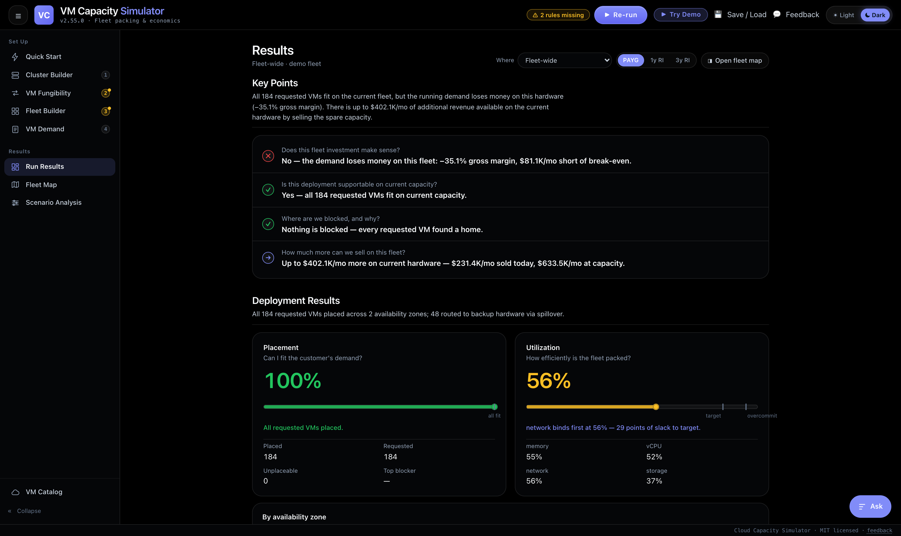
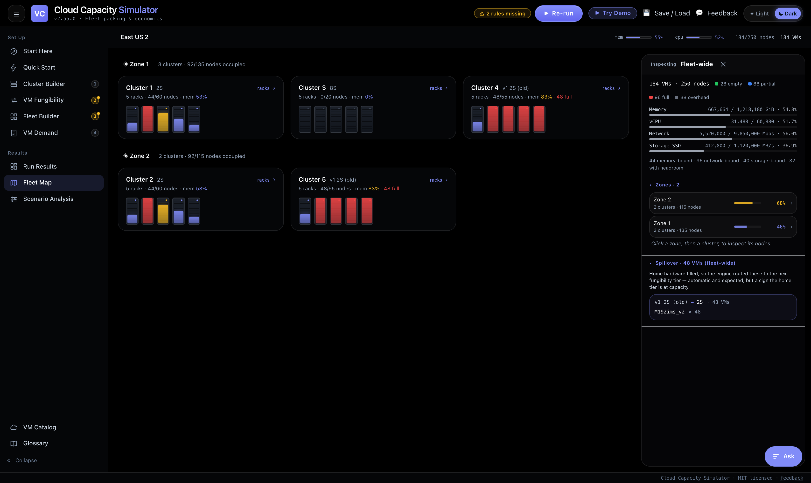
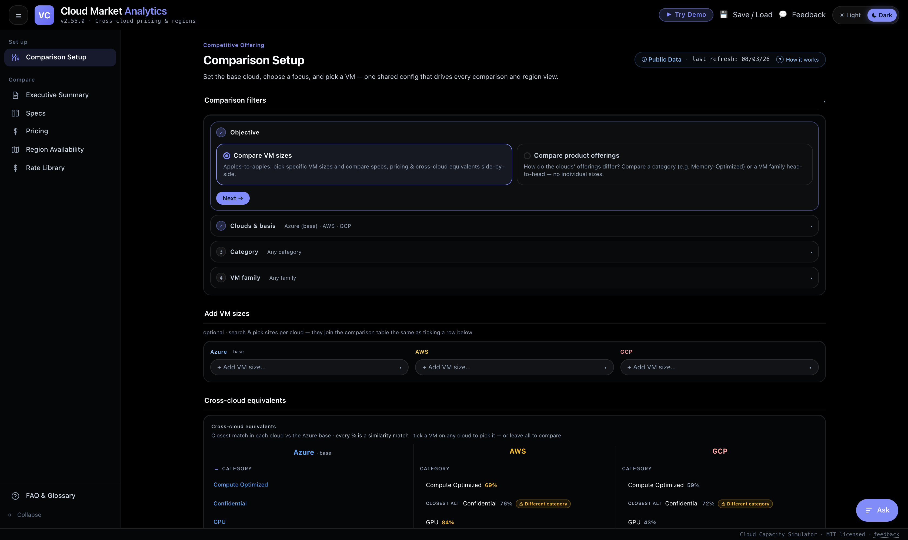
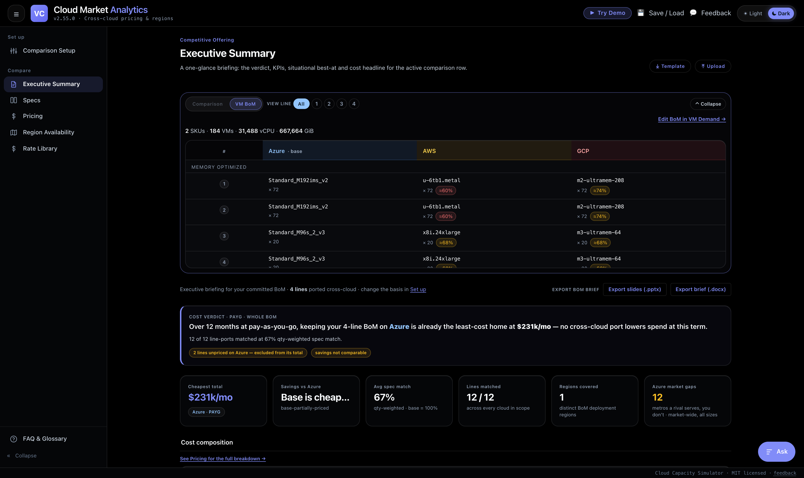

# Cloud Capacity Simulator

**Will this deployment actually land on the fleet we own — and if not, which resource is stopping it?**

That is the question this tool exists to answer. Not "do we have enough memory," not "what's our average utilization," but the real one: does every VM in a committed bill of materials find a node where **memory and vCPU and network bandwidth and storage throughput all clear at the same time** — and when one doesn't, exactly which of those four blocked it, on which node, by how much.

**▶ [Try the live demo](https://capacity-simulator-lemon.vercel.app/)** — click *Try Demo* in the header to load a worked fleet, then *Run simulation*. Runs entirely in your browser; nothing is uploaded.

---

## Feasibility is multi-dimensional

A deployment is not feasible because there is enough memory. It is feasible only when every binding resource clears **simultaneously, per node**. A cluster can sit at 55% memory utilization and still be unable to accept a single additional VM because vCPU zeroed out, or because the NIC budget is spent, or because a leftover sliver is too small for anything the workload is allowed to run.

Fleet-level averages cannot see any of this. Neither can a spreadsheet that divides total demand by total capacity. Both will tell you a deployment fits when it doesn't, and neither can tell you why.

[`src/engine/simulator.ts`](src/engine/simulator.ts) enforces **four co-equal binding constraints on every node**, checked together in a single `canFit()` predicate — a VM is placed only if it passes all four:

| # | Constraint | Node capacity | VM consumption |
|---|---|---|---|
| 1 | **Memory** (GiB) | `memoryGibPerNode` | `memoryGib` |
| 2 | **vCPU** | `socketsPerNode × coresPerSocket × HT`, or an explicit `vcpusPerNode` | `vcpus` |
| 3 | **Network bandwidth** (Mbps) | `networkMbpsPerNode`, falling back to `throughputCeilingMbps` | `networkMbps` |
| 4 | **Storage throughput** (MB/s) | `storageThroughputMbpsPerNode` — the per-node Premium SSD cap | `remoteStorageMbpsPremium` |

Hardware definitions also carry local-disk characteristics — `localDiskGib`, `localStorageGiB`, `localStorageIopsRR`, `localStorageMbpsRR`, and a separate `localStorageThroughputMbpsPerNode` distinct from the remote SSD cap — so a node's real shape is modeled rather than reduced to two numbers.

Memory-intensive workloads are a first-class case, and the engine was built with them in view. But the point is not any single resource. It's the **interaction**: the whole reason a fleet strands capacity is that the four dimensions run out at different rates on different nodes, and the one that binds first changes as the pack progresses.

### Binding-constraint diagnosis

Every node reports a `BindingConstraint`: `MEMORY | VCPU | NETWORK | STORAGE | NONE`. Every VM that fails to place reports **which resource blocked it, with both numbers stated in plain language**:

> `NETWORK` — "VM needs 12,500 Mbps network; this cluster's per-node network is 10,000 Mbps. Use a hardware group with more NIC bandwidth."

> `VCPU` — "VM needs 96 vCPUs; loosest open node (R2N4) has 48 vCPUs free."

> `STORAGE` — "VM needs 4,000 MB/s Premium SSD throughput; this cluster's per-node cap is 2,000 MB/s. Use a hardware group with more storage bandwidth."

Diagnosis is deliberately two-tiered, because "buy a different cluster" and "drop the SKU" are different decisions:

- `MEMORY` / `VCPU` / `NETWORK` / `STORAGE` — *this* cluster's nodes can't take it, but a larger cluster could
- `VM_OVERSIZED_MEMORY` / `VM_OVERSIZED_VCPU` / `VM_OVERSIZED_NETWORK` / `VM_OVERSIZED_STORAGE` — no node anywhere in the fleet can ever hold it

Oversize checks run as a **pre-flight**, before packing starts, so a VM that is physically impossible is named as such rather than appearing as a generic capacity shortfall at the end of the run. For nodes that are partially filled, the engine reports whichever resource is *most* consumed, so a planner can see which dimension a cluster will run out of next.

---

## The problem this solves

Capacity planning fails in two directions, and both are expensive.

**Over-buy** and you carry depreciation on nodes that never fill. **Under-buy** and you strand demand you already committed to. The gap between those outcomes is usually not a forecasting problem — it's a packing problem, and it's invisible at the altitude most planning is done.

The third failure mode is quieter and worse: a model that produces a confident number from data it doesn't actually have. A missing rate becomes a zero, an unmatched line item silently drops out of a total, and a savings recommendation reaches senior leadership built on a comparison where one side was only two-thirds priced.

This tool answers the first two concretely and structurally refuses the third.

### Decisions it supports

- **Feasibility** — can committed demand be placed on the current fleet, at what utilization, with how much stranded capacity
- **Diagnosis** — for every VM that didn't place, which of the four constraints blocked it, where, and by how much
- **Headroom** — how much more of a given size the fleet can absorb before it's out
- **Investment** — what a proposed cluster costs in capex and OPEX, what it earns at capacity, and whether payback lands inside the hardware's usable life
- **Sourcing** — for workload you've decided to place externally, what each cloud charges for the closest real equivalent

---

## The simulator

Define clusters (node shape, rack composition, buffer, fungibility rules), place them into regions and availability zones, load a bill of materials, and run.

Output is a rack map with per-node drill-down, an unplaceable list with diagnosed reasons and real numbers, utilization and stranded-capacity metrics across all four dimensions, and a financial view covering depreciation, OPEX, margin, revenue at capacity and payback.

Setup is workflow-ordered — **Cluster Builder → VM Fungibility → Fleet Builder → VM Demand** — with a Quick Start form that collapses all four into a single page. Results land on **Run Results**, **Fleet Map** (rack visualization with per-node, per-zone and financial drill-down), and **Scenario Analysis** (what *else* would fit on the fleet as it currently stands).

### Screenshots









---

## Engine rules

[`src/engine/simulator.ts`](src/engine/simulator.ts) is a pure function: `runSimulation(input) → SimulatorResult`. No I/O, no UI, no clock, no randomness. Same input, same output, always. Its behavior is pinned by [`src/engine/simulator.test.ts`](src/engine/simulator.test.ts) and documented in [`docs/ENGINE_RULES.md`](docs/ENGINE_RULES.md), including three locked acceptance scenarios whose expected placements, stranded memory and binding constraints are asserted exactly. If those move, the engine has a bug.

**Buffer resolution.** Reserve capacity as a flat percentage or a fixed node count. Reserved nodes are laid out first so the rack map reads buffer-first. Slots flagged as utility are forced to reserved regardless of the buffer, so workload never lands on a control-plane host — and those nodes are excluded from utilization math on both sides.

**Heterogeneous racks.** A rack composition can mix node sizes, with per-slot overrides on memory, vCPU, network and storage. The engine plans capacity per rack position rather than assuming a uniform node.

**Fungibility pre-flight.** Before any packing, each VM is checked against the routing matrix, keyed `[vmSizeName][hardwareGroupId]` with a per-class fallback. A numeric cell means allowed, and the value is the routing priority; `blocked` means explicitly disallowed; a missing cell is reported as `NOT_AUTHORED` — distinct from `BLOCKED_BY_MATRIX`, because "I said no" and "I haven't decided yet" are different states and a planner needs to tell them apart. Fleets with no matrix fall through to a legacy `homeFor` / `spilloverFrom` check; fleets with neither pack purely capacity-bound.

**Placement.** Two modes:
- `SMART` — best-fit decreasing. Sort by memory descending then vCPU descending, and place each VM on the open node with the *tightest* remaining memory that still fits. Minimizes stranding.
- `STRICT` — preserve BoM order, no sort. Models "place them in the order they were committed," and exercises genuine skip-and-continue that the SMART sort would otherwise mask.

**Skip and continue.** A VM that can't be placed is recorded and the engine moves on. It never halts on first failure, because a planner needs the entire failure set — and its shape across constraints — not the first item.

**Semantic full.** A node is marked `occupied-full` when no VM the workload is *authorized* to run on that hardware can fit the leftover sliver, not merely when one dimension hits zero. The remainder is stranded by definition, and the "full" chip can never contradict the "what else fits" list because both read the same authorized set.

**Stranded math.** Stranded memory and vCPU are summed strictly over nodes that received at least one VM. Empty deployable nodes and reserved nodes never contribute — otherwise buffer would masquerade as waste.

**Isolated hosts.** Clusters can run one VM per node, with surplus VMs flagged `ISOLATED_HOST` rather than silently packed.

**Financial layer.** [`src/utils/financial.ts`](src/utils/financial.ts) and [`src/utils/investment.ts`](src/utils/investment.ts) take the run result and compute cluster capex and monthly depreciation over usable life, OPEX, revenue at capacity at pay-as-you-go / 1yr / 3yr, gross margin, sellable headroom, and payback — with payback evaluated explicitly *against* the hardware's usable life, so an investment that pays back after the box is due for retirement reads as a failure rather than as a number.

---

## Accuracy: it refuses to state a number it can't defend

This is the other design center, and the part that took the most work.

**Unpublished values stay `null`.** If a vendor doesn't publish a figure, the field stays null through ingest, join and render. Nothing is interpolated to fill a gap. `"EBS only"` becomes zero local disk, not an estimate.

**Estimated values are labeled, everywhere.** A curated processor mapping renders as `(assumed)`. A network figure from a legacy doc fallback, or a reserved rate derived from pay-as-you-go, renders as `(est.)`. Those markers survive into the PPTX and DOCX exports as footnotes on the slides that carry them — the failure mode where caveats live in the app and vanish in the deck is exactly the one that gets someone burned in a review.

**Savings claims are suppressed when the comparison isn't sound.** `bomVerdictCore` in [`src/components/compare/execBriefMath.ts`](src/components/compare/execBriefMath.ts) states a saving only when **both** the base and the winning scenario are *fully* priced — every BoM line matched and priced, not merely most of them. Otherwise it returns `savingMonthly: null` and a machine-readable reason:

| Reason | Meaning |
|---|---|
| `base-unpriced` | The base produced no usable total |
| `base-partially-priced` | Some base lines are unmatched or unpriced, so the base total undercounts |
| `cheapest-partially-priced` | The apparent winner is undercounted, so its lead may be an artifact |

Notably, "the base already wins" is *also* suppressed off a partially-priced base. A favorable answer gets the same scrutiny as an unfavorable one — that asymmetry is where most tools quietly cheat.

**One kernel per number.** Every picked-pair match percentage on every surface comes from `pairMatchPct` in [`src/components/compare/specShowdownMath.ts`](src/components/compare/specShowdownMath.ts); every cost verdict comes from `bomVerdictCore`. Two views cannot disagree about the same fact, because there is exactly one place the fact is computed.

**List prices only.** All pricing is vendor-published list pricing. No negotiated rates, no spot, no assumed discounts.

The practical effect is that the tool sometimes answers "I can't tell you that yet, and here's what's missing." That's the correct output when the underlying data is incomplete, and it's the output a planner can take into a room and stand behind.

---

## Cross-cloud market analytics

A secondary surface, for the case where the answer to "will it land here" is no and something has to be sourced elsewhere.

Pick a base VM size and the equivalency engine finds the closest peer on each other cloud computed from live catalog specs, not a hand-curated lookup table. Product category is a hard gate; within it, distance is a weighted blend over log-ratios of vCPU, memory and memory-per-vCPU, with preference for matching CPU architecture and accelerator count. Log-ratios mean 4↔8 vCPU is penalized the same as 64↔128 — proportional, not absolute. Region equivalency ranks by country first (data residency is the dominant constraint), then great-circle distance; sovereign regions match only other sovereign regions.

Views: **Executive Summary** (verdict-first), **Specs**, **Pricing** (PAYG and 1yr/3yr reserved), **Region Availability**, and a per-region **Rate Library**. Executive summaries export to PPTX and DOCX with the caveats carried through.

---

## Data pipeline

[`scripts/ingest/`](scripts/ingest/) pulls specs, network bandwidth and pricing from vendor sources and writes static JSON the app serves like any other asset.

| Source | Data | Auth |
|---|---|---|
| Azure Retail Prices API | PAYG / 1yr / 3yr rates | none |
| Azure compute docs (parsed) | per-size network Mbps | none |
| Azure Resource SKUs API | vCPU / RAM / disk / GPU | service principal |
| AWS Price List Bulk API | rates, specs, network | none |
| GCP family rules + docs | specs, network | none |
| GCP Cloud Billing Catalog API | rates | API key |

Per-size network bandwidth is exposed by no vendor API on Azure — it exists only in documentation. The pipeline parses the published docs directly. That is the reason network can be a real binding constraint in the engine rather than an estimate.

**Sharded by region.** Rates land as one JSON per region under `public/rates/<provider>/`; region-independent specs and network live in `_specs.json` and `_network.json`. The app lazy-loads only the regions it is pricing and joins `specs ⨝ network ⨝ rates` at load time, so "every SKU × every region" never enters the bundle or `localStorage`.

### Integrity gates

The weekly refresh commits regenerated shards straight back to `main`, which means a bad pull could silently ship worse data than what's already there. Two scripts stand between the pull and the commit.

[`build-manifests.mjs`](scripts/ingest/build-manifests.mjs) scans the fresh shards into `public/rates/_manifest.json` — row counts, coverage percentages, and join health per cloud (rows joined, rates with no matching spec, specs never priced).

[`validate-shards.mjs`](scripts/ingest/validate-shards.mjs) diffs that manifest against the one committed at `HEAD` and **exits non-zero**, failing the job, on any of:

- spec / network / rate row counts shrinking more than 5% versus the previous run
- processor or network coverage dropping more than one percentage point
- unjoined rates exceeding a per-cloud floor
- a schema sample check failing on 20 spec records per cloud

It runs *before* the commit step, deliberately. A bad pull fails there, and the last known-good shards survive untouched.

The [weekly Action](.github/workflows/refresh-rates.yml) runs Mondays at 07:00 UTC and on demand. Keyless pulls always run; the two credentialed pulls are skipped rather than fatal when their secrets are absent, so a missing key degrades coverage instead of breaking the refresh — and a staleness report warns when a credentialed shard ages past 30 days with no secret set, so the gap stays visible instead of rotting quietly. Region availability tables are regenerated from the vendor docs in the same job, with a test that fails CI if they ever drift.

At the last committed refresh the shards cover **230 region-provider pairs and roughly 108,000 priced SKU rows**; `public/rates/_manifest.json` carries the exact current counts.

---

## Architecture

**Pure engine, thin shell.** The simulator and the equivalency, pricing and financial math are plain TypeScript functions with no React and no I/O. The UI reads their output. This is why the engine is testable at all, and why the acceptance scenarios can be asserted to the GiB.

**One state, one reducer.** [`src/state/AppState.ts`](src/state/AppState.ts) defines a single `AppState` and a single `reducer` over a typed `Action` union of 47 actions. No scattered stores. State persists to `localStorage` behind a schema version, so a stale save is migrated or discarded rather than silently misread.

**Static data, lazily loaded.** Sharded JSON served as assets, fetched per region on demand.

**Client-side.** All simulation, pricing, equivalency and export math runs in the browser. There is no application server, no account, no login and no telemetry — nothing you load leaves your machine. (One exception, off by default: an optional in-app assistant that answers questions about what's on screen routes through a small serverless proxy so a hosted-model API key stays server-side. With no key configured it falls back to a deterministic local mock, and the rest of the app never touches the network.)

**Bring your own data.** The bundled public catalog gets you running immediately, but hardware shapes, VM sizes, fungibility matrices and bills of materials are all importable from Excel templates for anything the public catalogs don't cover.

---

## Tech stack

React 18 · TypeScript 5.6 · Vite 6 · Tailwind CSS 3.4 · Vitest 2

`react-simple-maps` + `d3-geo` for region cartography, `pptxgenjs` and `docx` for leadership exports, `xlsx` for template import and export. No backend framework, no state library, no UI kit.

---

## Running it

```bash
npm install
npm run dev        # http://127.0.0.1:5173
npm test           # Vitest — 937 tests across 49 files
npm run typecheck  # tsc --noEmit
npm run build      # tsc -b && vite build
```

---

## How this was built

This is a personal project, built on my own time, using **only public vendor data** — published specification documentation and public list pricing. It contains no proprietary, internal or employer data of any kind, and it is not in production use anywhere.

It was developed with heavy assistance from AI coding assistants and multi-agent orchestration. That's worth being direct about, because it's a real part of how the project reached this scope. What the AI did not decide: the domain model, which constraints bind and in what priority, how a blocked placement should be diagnosed, what counts as a defensible number versus a suppressed one, or where the honesty gates go. Those required knowing how capacity planning actually fails in practice, and they're the parts I own. The AI wrote a great deal of the code that implements them, and I reviewed, tested and rejected a great deal of it.

The engine test suite exists largely because of that workflow. When code arrives faster than you can read it line by line, locked acceptance scenarios are what stop a plausible-looking refactor from quietly changing what the tool tells you.

---

## License

MIT — see [LICENSE](LICENSE).
